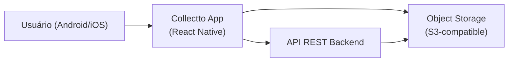
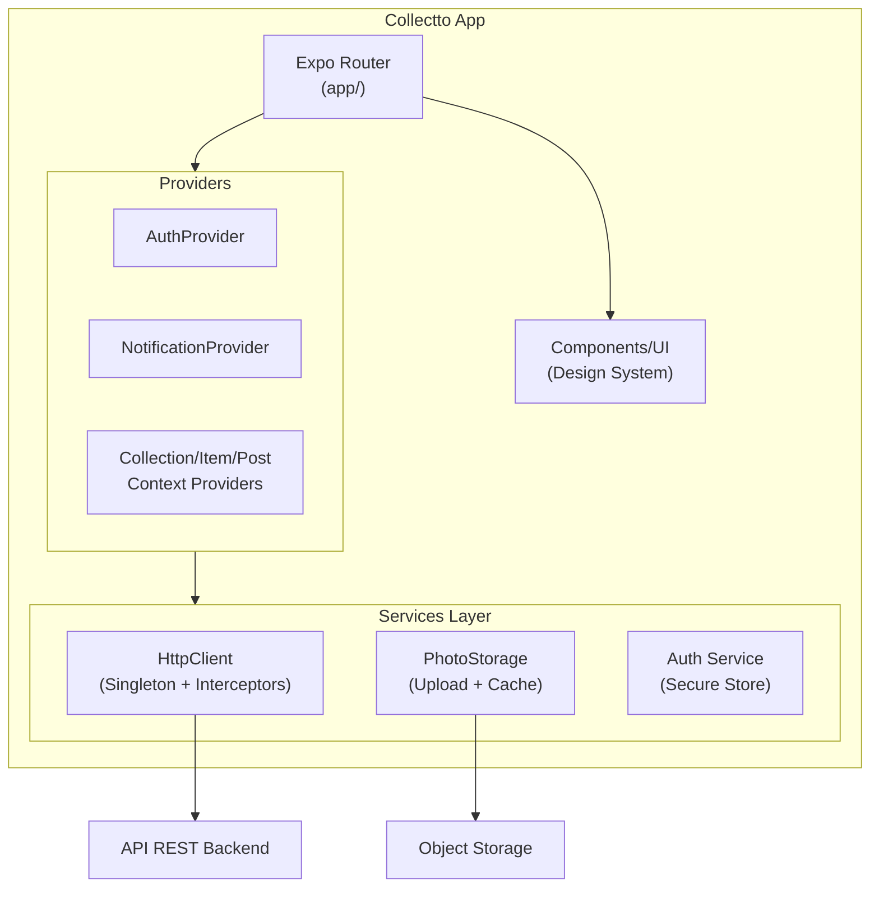
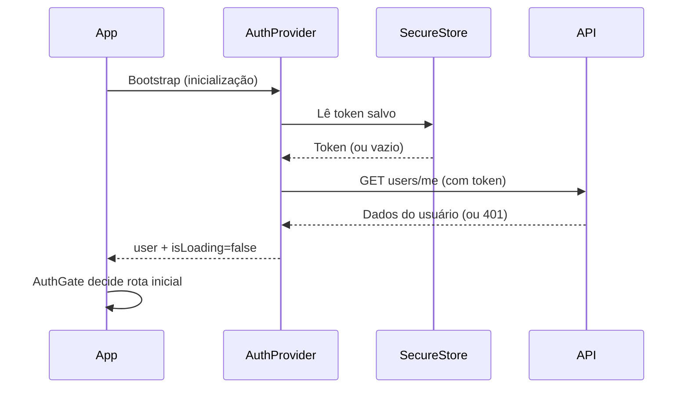
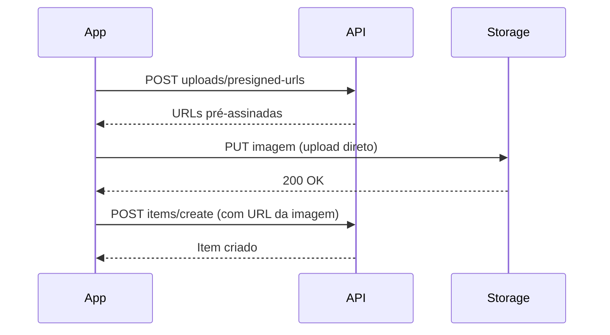
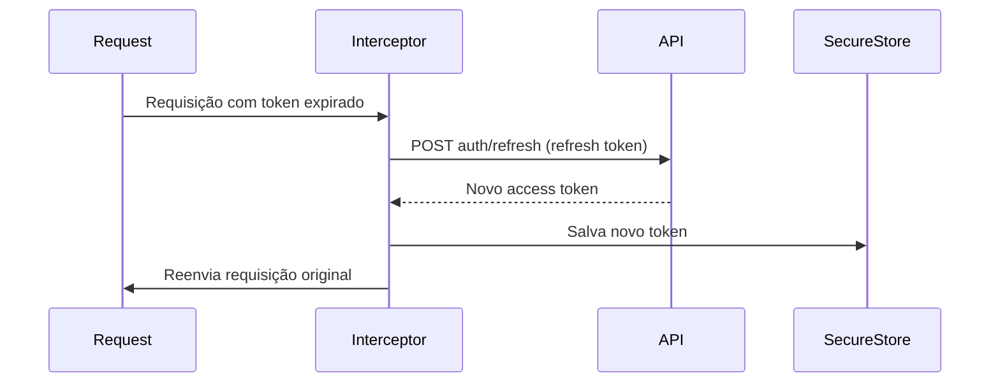

# Documentação Arquitetural — Collectto

---

# Visão Geral

## Objetivo

O Collectto frontend é um aplicativo mobile em React Native organizado em camadas bem definidas: roteamento por sistema de arquivos (Expo Router), estado global via React Context, comunicação com API REST via cliente HTTP centralizado com singleton e interceptors, e design system por tokens com NativeWind.

## Contexto

O frontend é um dos dois componentes do produto Collectto. Ele consome uma API REST backend (não gerenciada neste repositório) e faz upload direto de imagens para um serviço de armazenamento externo (S3-compatible). O usuário final acessa o app em dispositivos Android e iOS.

---

# Visão de Contexto

## Diagrama de Contexto

### Explicação

- O **usuário** interage com o app mobile (Android ou iOS).
- O **app** consome a **API REST backend** para todas as operações de dados (auth, coleções, itens, feed, notificações).
- O **app** realiza upload de imagens diretamente para o **Object Storage** via presigned URLs geradas pela API — a API não processa o arquivo diretamente.
- A **API** também acessa o Storage para operações de leitura e geração de URLs.

---

# Componentes de Alto Nível

## Principais Componentes

- **Expo Router (app/):** Roteamento por sistema de arquivos. Define grupos `(auth)` e `(tabs)`, além de stacks aninhados para coleções e usuários.
- **Providers:** Camada de estado global via React Context. `AuthProvider` gerencia sessão JWT; `NotificationProvider` gerencia notificações; providers de coleção/item/post encapsulam estado de contexto.
- **HTTP Client (services/api/):** Singleton `HttpClient` baseado em Axios com interceptors de autenticação, retry automático e tratamento padronizado de erros.
- **Services:** Funções de endpoint por domínio (usuários, coleções, itens, feed, uploads, notificações).
- **Components/UI:** Componentes reutilizáveis do design system com props tipadas e acessibilidade mínima.
- **Design System (styles/):** Tokens centralizados em `tokens.js`, classes utilitárias via NativeWind/Tailwind.

## Diagrama de Componentes

---

# Fluxos Arquiteturais

## Fluxo de Autenticação

## Fluxo de Upload de Imagem

## Fluxo de Refresh de Token

---

# Integrações

## Sistemas Externos

| Sistema | Tipo de Integração | Finalidade |
| ------- | ------------------ | ---------- |
| API REST Backend | HTTPS / REST (Axios) | Dados de usuários, coleções, itens, feed e notificações |
| Object Storage (S3-compatible) | HTTPS / PUT direto | Upload de imagens de perfil e itens via presigned URLs |

---

# Requisitos Arquiteturais

- **Multiplataforma:** O app deve funcionar corretamente em Android e iOS com comportamento consistente entre plataformas.
- **Segurança de sessão:** Tokens JWT armazenados exclusivamente via `expo-secure-store` (não em AsyncStorage ou localStorage).
- **Resiliência de rede:** O cliente HTTP aplica retry automático com backoff exponencial para falhas transitórias.
- **Desempenho:** Evitar re-renders desnecessários; uso de memoização apenas onde há benefício mensurável.

---

# Restrições Arquiteturais

- O frontend é exclusivamente mobile; não é considerado suporte a desktop.
- O estado de autenticação e autorização no cliente serve apenas para UX; toda validação real ocorre na API.
- Não há persistência offline; todas as operações requerem conectividade.
- Secrets e chaves de API não devem ser expostos no bundle do app; usar variáveis de ambiente `EXPO_PUBLIC_*` apenas para valores não sensíveis.

---

# Referências

- [Documentação Funcional](./funcional.md)
- [Documentação Técnica](./tecnica.md)
