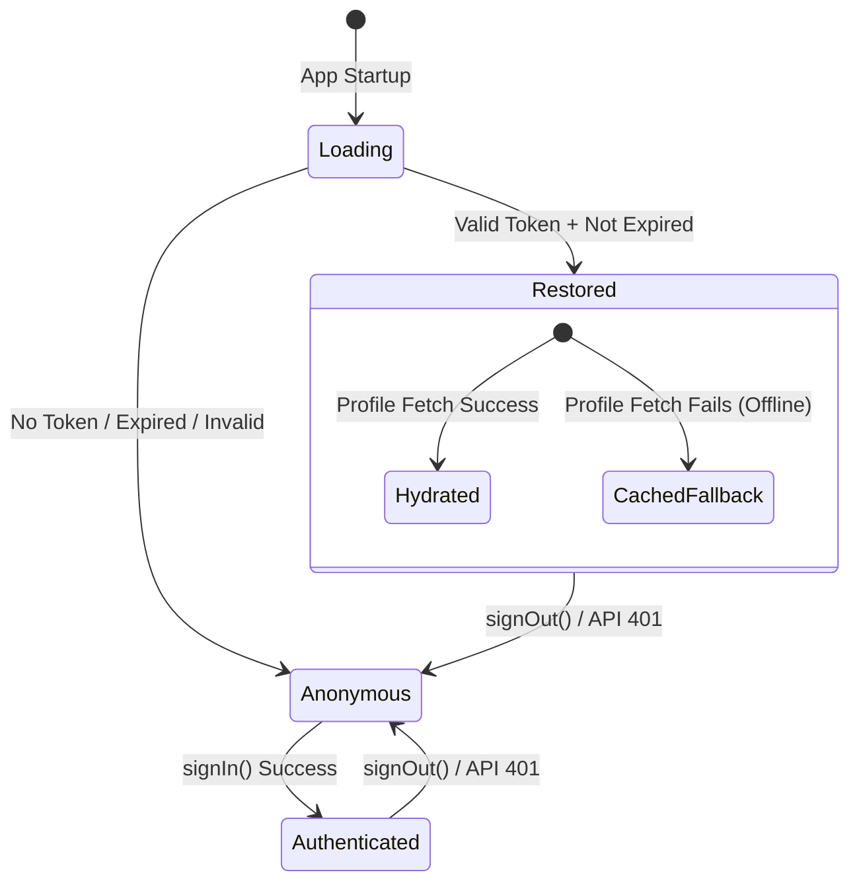

# Data Model: Session Storage and Restoration

This document details the data structures, validation constraints, and state transitions used to manage persistent authentication sessions.

## 1. SecureStore Schema

The token is stored in the device's native secure enclave using a single key-value mapping.

### SecureStore Entry
- **Key**: `collectto.session.token`
- **Value**: Encrypted UTF-8 string containing the raw JWT token.
- **Constraints**:
  - Value size must be under 2048 bytes (typical platform Keychain/EncryptedSharedPreferences limit).
  - Must never contain plain text credentials (passwords, usernames).

---

## 2. JWT Token Structure

The token retrieved from storage is parsed as a JSON Web Token (JWT) consisting of three base64url-encoded parts separated by periods (`.`).

### Parts
1. **Header**: Metadata about the token type and hashing algorithm.
2. **Payload**: User claims and metadata.
3. **Signature**: Cryptographic signature (not verified client-side, but must be present).

### Payload Claims Schema (Client-Decoded)
We extract the following fields from the decoded JWT payload:

| Field | Type | Required | Description |
| :--- | :--- | :--- | :--- |
| `userId` / `sub` | `string` | Yes | Unique identifier of the user. Mapped to `user.id`. |
| `email` | `string` | No | User's email. Mapped to `user.email`. |
| `exp` | `number` | Yes | Expiration timestamp in UNIX epoch seconds. |
| `name` | `string` | No | User's display name. Mapped to `user.name`. |
| `username` | `string` | No | User's handle. Mapped to `user.username`. |

---

## 3. In-Memory Session State

Managed within `AuthProvider` in React state.

| State Field | Type | Initial Value | Description |
| :--- | :--- | :--- | :--- |
| `isLoading` | `boolean` | `true` | Set to `false` only after bootstrap check is complete. |
| `user` | `AuthUser \| null` | `null` | The authenticated user model, or null if unauthenticated. |

---

## 4. Validation Rules

All validation occurs during app bootstrap (in `bootstrapSession`) or upon receiving a login token.

### Format Validation (FR-011)
- The token must be a string.
- Splitting the string by `.` must yield exactly 3 segments.
- Each segment must be a non-empty string.
- If validation fails: The storage is cleared, the session is treated as logged out.

### Expiration Validation (FR-004)
- The payload must contain an `exp` field (number).
- The current timestamp `Math.floor(Date.now() / 1000)` must be strictly less than `exp`.
- If expired: The token is deleted, headers are cleared, session is treated as logged out.

---

## 5. State Transitions

The lifecycle of the authentication state follows the transitions shown below:

### Transition Detail
1. **Initialize (`App Startup`)**:
   - Reads `SecureStore`.
   - If token is present, valid format, and not expired -> transition to **Restored**.
   - Otherwise -> transition to **Anonymous**.
2. **Hydration (within Restored)**:
   - Attempt to call `getUserById` with the token's `userId`.
   - If success -> update user state with full profile (**Hydrated**).
   - If network/server failure -> fallback to token claims (**CachedFallback**) to allow offline usage.
3. **Sign In**:
   - Call `/auth/login`.
   - If success, save token to `SecureStore` (if persistent session enabled) and set user state. Transition to **Authenticated**.
4. **Sign Out / Invalidation**:
   - Clear `SecureStore`.
   - Delete API request Authorization header.
   - Set user state to `null`. Transition to **Anonymous**.
