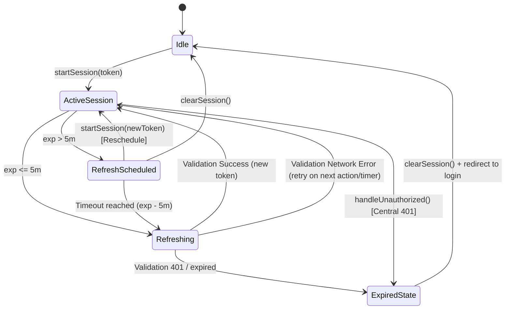

# Contract: SessionRefreshManager

This document defines the TypeScript interface and operational contract for the `SessionRefreshManager` class.

## 1. Class Interface

```typescript
import { RefreshAttempt } from '../types/auth-refresh';

export interface ISessionRefreshManager {
  /**
   * Initializes the manager by hook/callback bindings.
   * Typically called within the AuthProvider initialization block.
   * 
   * @param onUnauthorized Callback triggered when a 401 or expiration logout occurs
   * @param onTokenRefreshed Callback triggered when a new token is successfully obtained
   */
  initialize(
    onUnauthorized: () => Promise<void>,
    onTokenRefreshed: (newToken: string) => Promise<void>
  ): void;

  /**
   * Evaluates the current token, schedules the refresh timer,
   * or triggers immediate actions if near expiration/expired.
   * 
   * @param token The raw JWT token string
   */
  startSession(token: string): void;

  /**
   * Cancels the active refresh timer and resets session state.
   * Called during manual logout or reactive de-authorization.
   */
  clearSession(): void;

  /**
   * Re-evaluates remaining token time. Typically bound to AppState active transitions.
   * Handles immediate refresh or logout based on state.
   */
  reconcileSessionState(): Promise<void>;

  /**
   * Triggers the unauthorized callback. Central entrance for Axios 401 interceptors.
   */
  handleUnauthorized(): Promise<void>;

  /**
   * Returns a copy of the recorded refresh attempts for debugging.
   */
  getRefreshAttempts(): RefreshAttempt[];
}
```

---

## 2. Event & State Diagram



---

## 3. Core Logic Sequence

### 3.1 Proactive Token Refresh
1. Timer fires at `T - 5m`.
2. Check network connectivity.
3. If offline, defer refresh (log attempt as skipped/failed, keep session active).
4. If online, make asynchronous call to `/users/me` (or session validation).
5. If `/users/me` returns `200 OK` and a new token is present in the response headers or body:
   - Call `onTokenRefreshed(newToken)`.
   - Update stored token and common headers.
   - Schedule next timer.
   - Log attempt as `success`.
6. If `/users/me` returns `401 Unauthorized`:
   - Call `handleUnauthorized()`.
   - Log attempt as `failed`.

### 3.2 Centralized 401 Reactive Logout
1. Axios interceptor catches a `401 Unauthorized` response on any endpoint.
2. Interceptor calls `sessionRefreshManager.handleUnauthorized()`.
3. `SessionRefreshManager`:
   - Cancels active `refreshTimerId`.
   - Invokes `onUnauthorized()` callback.
4. `AuthProvider` clears local user state, clears SecureStore token, resets Axios headers, and redirects user to `/(auth)/tela_inicial`.
