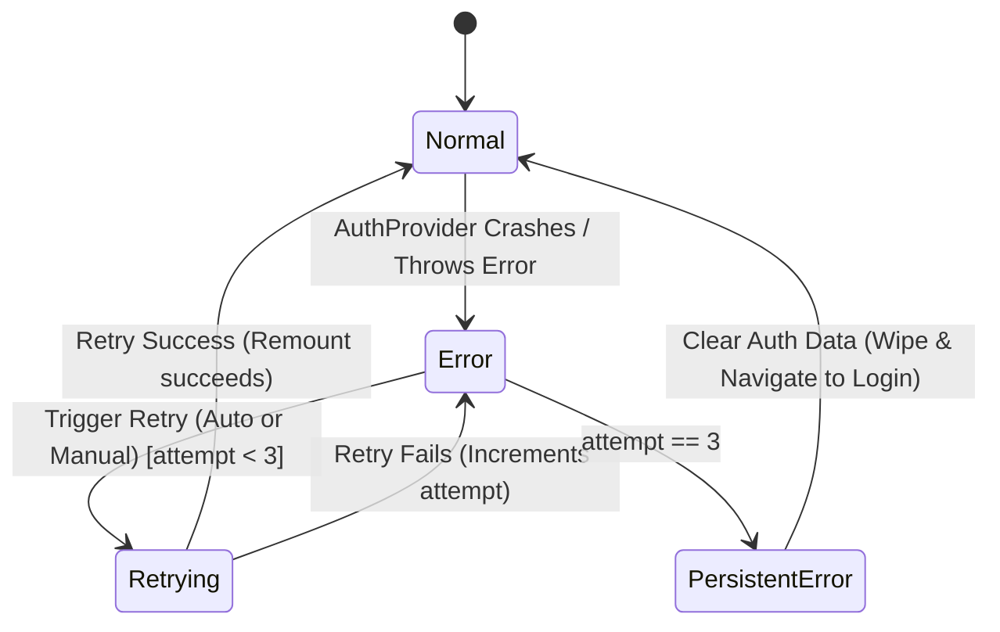

# Data Model: Auth Error Boundary

This document defines the data structures, types, state transitions, validation rules, and storage details for the Auth Error Boundary.

## 1. Data Structures & TypeScript Types

### `AuthErrorType`
An enumeration or union type classifying the error caught by the boundary to determine the appropriate fallback UI and recovery flow.

```typescript
export type AuthErrorType =
  | 'NETWORK'        // Offline state or network failures
  | 'TIMEOUT'        // Backend request timeout
  | 'STORAGE'        // SecureStore read/write/delete failures
  | 'PARSING'        // Corrupted/unparseable token payload
  | 'UNKNOWN';       // Any other unhandled error
```

### `AuthErrorInfo`
Model encapsulating the metadata of the error for rendering and non-sensitive logging.

```typescript
export interface AuthErrorInfo {
  type: AuthErrorType;
  message: string;        // User-friendly localized message
  technicalMessage: string; // Original error message (e.g. error.message)
  stack?: string;         // Stack trace (non-sensitive)
  timestamp: string;      // ISO string of when error occurred
}
```

### `RetryState`
State tracking variables for the retry controller inside the Error Boundary.

```typescript
export interface RetryState {
  attemptCount: number;   // Current retry attempt (0 to 3)
  isRetrying: boolean;    // Loading indicator state during retry
  lastAttemptTime?: string; // ISO string of the last retry attempt
}
```

---

## 2. State Transitions & Logic

The Error Boundary operates as a state machine managing transitions between Normal, Error, Retrying, and Recovery states.



### State Transition Conditions
1. **Normal to Error**: AuthProvider throws an unhandled error during render (which is bubbled from its internal catch block).
2. **Error to Retrying**:
   - *Manual*: User taps "Tentar Novamente".
   - *Automatic*: Reconnection is detected via NetInfo (only if error type is `NETWORK`).
   - *Guard*: Only transitions if `attemptCount < 3`.
3. **Retrying to Normal**: Auth system successfully bootstraps after remounting.
4. **Retrying to Error**: Re-evaluation fails; `attemptCount` increments. If `attemptCount` reaches 3, transitions to `PersistentError`.
5. **PersistentError/Error to Normal (Recovery)**: User taps "Limpar Dados". Executes storage purge, resets `attemptCount` to 0, and resets error state (remounting the tree into the login stack).

---

## 3. Storage & Storage Validation

The feature interacts with standard device secure storage via `expo-secure-store`.

### SecureStore Details
- **Storage Key**: `collectto.session.token`
- **Data Format**: JWT string (standard three-part dot-separated string).
- **Validation Rules**:
  - Must not be empty.
  - Must consist of exactly three dot-separated parts (header.payload.signature).
  - The payload (second part) must be valid Base64Url and must parse to a JSON object containing at least one user identifier (`userId`, `sub`, `id`, `uid` or `email`).

### Purge Policy
- Clicking "Clear Auth Data" must perform an atomic delete operations on the key:
  - `SecureStore.deleteItemAsync('collectto.session.token')`
- Deletion errors must be caught defensively to prevent fallback UI loops.
