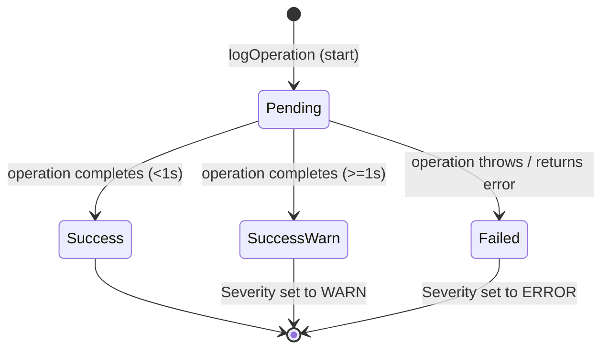

# Data Model: Structured Logging for Authentication Events

This document defines the data structures, types, validation rules, and in-memory state transitions for the structured logging system.

## 1. Entities

### Entity: `AuthLog`

Represents a single structured log entry for an authentication operation.

| Field | Type | Description | Validation / Constraints |
|---|---|---|---|
| `id` | `string` | Unique identifier for the log entry. | MUST be a valid UUID v4. |
| `timestamp` | `string` | The date and time when the event occurred. | MUST be ISO 8601 string format. |
| `module` | `string` | Name of the module/caller (e.g., `"AuthProvider"`, `"TokenManager"`). | MUST be a non-empty string. |
| `action` | `string` | The auth operation (e.g., `"login"`, `"logout"`, `"tokenRefresh"`, `"tokenValidation"`). | MUST be a non-empty string. |
| `status` | `string` | The completion state of the operation. | MUST be one of: `"pending"`, `"success"`, `"failed"`. |
| `errorType` | `string \| null` | Code or classification of the error if status is `"failed"`. | E.g., `"network_timeout"`, `"exp_invalid"`, `"invalid_credentials"`. |
| `duration` | `number \| null` | The time taken to execute the operation in milliseconds. | MUST be a non-negative number. |
| `retryCount` | `number \| null` | Number of times the operation was retried. | MUST be a non-negative integer if present. |
| `severity` | `string` | Log severity level. | MUST be one of: `"info"`, `"warn"`, `"error"`. |
| `sanitizedError` | `string \| null` | A sanitized, redact-safe version of any error message/stack trace. | MUST NOT contain tokens, passwords, emails, or credentials. |

---

## 2. In-Memory Buffer Structure

### Entity: `LogBuffer`

The `LogBuffer` holds active log entries in memory. It operates as a first-in-first-out (FIFO) circular structure.

- **Storage Type**: In-memory JavaScript array (`AuthLog[]`).
- **Maximum Capacity**: Exactly 100 entries.
- **Eviction Rule**: When a new log is added and length is 100, the oldest log (index 0) is evicted (`shift()`) before the new log is appended (`push()`).
- **Persistence**: None. It is not written to `AsyncStorage`, SQLite, or files.
- **Lifetime**: Session-bound. It is instantiated when the app loads and is lost on reload/restart.

---

## 3. State Transitions & Rules

### AuthLog State Flow

When an operation begins:
1. Create entry with `status: "pending"`, `severity: "info"`, and start timestamp.
2. Push entry to `LogBuffer`.

When the operation completes successfully:
1. Update `status` to `"success"`.
2. Compute `duration = Date.now() - startTime`.
3. If `duration >= 1000`, set `severity` to `"warn"`, else keep `"info"`.
4. Update the existing entry in `LogBuffer`.

When the operation fails:
1. Update `status` to `"failed"`.
2. Set `severity` to `"error"`.
3. Compute `duration = Date.now() - startTime`.
4. Run error message through the redaction system.
5. Set `errorType` and `sanitizedError`.
6. Update the existing entry in `LogBuffer`.

---

## 4. Validation Rules & Data Sanitization

- **Automatic Redaction Validation**: Any string field inside `sanitizedError` or metadata payload must be scanned against the following rules before writing:
  - If a JWT pattern is found, replace with `"[REDACTED_JWT]"`.
  - If an email pattern is found, replace with `"[REDACTED_EMAIL]"`.
  - If a base64 basic credential pattern is found, replace with `"[REDACTED_CREDENTIALS]"`.
  - If an object payload contains key names matching `password`, `token`, `accessToken`, `refreshToken`, `email`, or `authorization`, replace the values with `"[REDACTED]"`.
