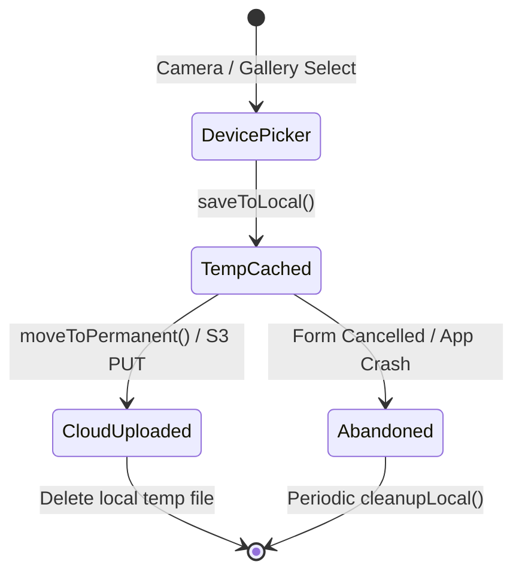

# Data Model and Schema Specification: Unified Upload and Local Storage

This document defines the entity structures, schemas, and state transitions for the frontend image uploading and local file storage lifecycle.

---

## 1. Local Cache Storage Lifecycle

All local media files transition through the following states:

---

## 2. Types and Entities

### UploadContext (Enum)
Context identifier mapped to backend storage directories:
- `PROFILE_PICTURE`: User avatars
- `PROFILE_BACKGROUND`: User profile background banners
- `COLLECTION`: Cover image for a collection
- `ITEM`: Photo(s) of a collection item

### FileInput (Type)
Metadata sent to pre-signed URL generator:
- `fileName`: string (sanitized name)
- `contentType`: string (media MIME type)

### GenerateUploadUrlsRequest (Payload)
- `context`: UploadContext
- `resourceId`: string (UUID)
- `parentId`: string (UUID, optional, used for `ITEM`)
- `files`: FileInput[]

### FileOutput (Type)
Pre-signed upload endpoints returned by the API:
- `filePath`: string (relative path in the cloud bucket)
- `uploadUrl`: string (full pre-signed S3/Oracle write URL)

### GenerateUploadUrlsResponse (Payload)
- `resourceId`: string (UUID)
- `files`: FileOutput[]

---

## 3. Database Schema Mapping

The relative file paths (`filePath`) returned by the upload service are mapped to fields in the backend database entities:

| Frontend Hook / Form | Request Payload Field | Example Data Path |
|---|---|---|
| `useCollectionCreation` | `coverImageUrl` | `collections/userId/collectionId/filename.jpg` |
| `useCollectionUpdate` | `coverImageUrl` | `collections/userId/collectionId/filename.jpg` |
| `useItemSave` | `imageFilesUrls` (array) | `["items/userId/collectionId/itemId/filename.jpg"]` |
| `useItemUpdate` | `imageFilesUrls` (array) | `["items/userId/collectionId/itemId/filename.jpg"]` |
| `useProfileUpdate` | `profilePictureUrl` | `profiles/userId/avatar.jpg` |
| `useProfileUpdate` | `profileBackgroundUrl` | `profiles/userId/banner.jpg` |
